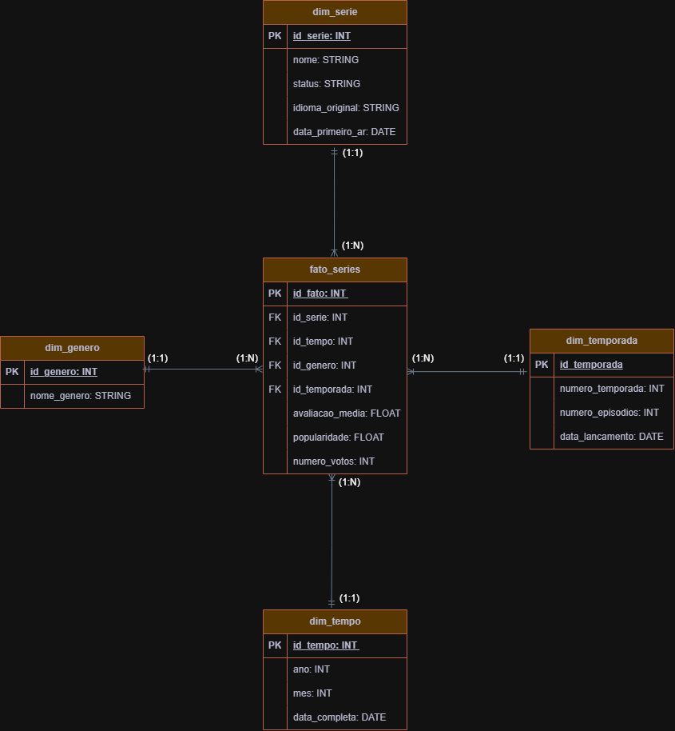

# Projeto BI Data Warehouse: 

# Séries drama/criminal com API do TMDB  

# Primeira Fase do Projeto: 

<h2>

Aluno: Igor Alessandretti

 

Matrícula: 202839

 

Curso: Análise e Desenvolvimento de Sistemas 

</h2>

# Objetivo: 

<h2>

Construir um data warehouse a partir de dados reais de séries conectando com api do TMDB, aplicar conceitos de ETL para no final extrair as análises utilizando o PowerBI. 

</h2>

# 📈 Etapas do Projeto:

- <h2> 1. Modelagem do Data Warehouse </h2>

Inicialmente, foi realizado o desenho do modelo dimensional (Star Schema), definindo a tabela fato (fato_series) e as dimensões (dim_serie, dim_genero, dim_temporada e dim_tempo).

- <h2> 2. Criação das tabelas no PostgreSQL  </h2>

As tabelas foram implementadas no banco de dados PostgreSQL com base no modelo definido, garantindo a estrutura necessária para análise.

 

# 📖 Dicionário de Dados: DW Séries

 

🧾 Tabela: fato_series

id_fato: Identificador único do registro da fato (Chave Primária).

id_serie: Chave estrangeira referenciando a dimensão de séries.

id_tempo: Chave estrangeira referenciando a dimensão de tempo.

id_genero: Chave estrangeira referenciando a dimensão de gênero.

id_temporada: Chave estrangeira referenciando a dimensão de temporada.

avaliacao_media: Nota média (0 a 10) atribuída à série ou temporada.

popularidade: Índice numérico de alcance e engajamento da produção.

numero_votos: Quantidade total de avaliações recebidas para o cálculo da média.

 

📋 Tabela: dim_serie

id_serie: Identificador único da série (Chave Primária).

nome: Título oficial da série.

status: Situação atual da obra (ex: "Returning Series", "Ended", "Canceled").

idioma_original: Sigla que representa o idioma de origem da produção.

data_primeiro_ar: Data de exibição do episódio piloto (estréia mundial).

 

📋 Tabela: dim_temporada
id_temporada: Identificador único da temporada (Chave Primária).

numero_temporada: Número sequencial que identifica a temporada (ex: 1, 2, 3).

numero_episodios: Quantidade de episódios contidos naquela temporada específica.

data_lancamento: Data oficial de lançamento da temporada.

 

📋 Tabela: dim_tempo
id_tempo: Identificador único da data (Chave Primária).

ano: Ano correspondente ao registro (formato AAAA).

mes: Mês correspondente ao registro (1 a 12).

data_completa: Data no formato completo (DD/MM/AAAA).

 

📋 Tabela: dim_genero
id_genero: Identificador único do gênero (Chave Primária).

nome_genero: Nome descritivo da categoria (ex: "Ação", "Documentário", "Drama").

 

# Segunda Fase do Projeto: 

<h1>O processo de ETL com os arquivos extract, transform e load encontra-se em:</h1>

# [ETL](./etl)

 

# Documentação: Pipeline ETL de Séries (TMDB API)

<h2>Extração (extract.py):</h2>

<h4>

Responsável por consumir os dados brutos da API externa.

Fonte: API do The Movie Database (TMDB).

Lógica: Realiza requisições paginadas (1 a 10) filtrando pelo gênero "Crime" (ID 80).

Saída: Salva os dados brutos em formato CSV em data/raw/series_raw.csv.

Segurança: Utiliza variáveis de ambiente (.env) para gerenciar a chave da API. </h4>

<h2> Transformação (transform.py): </h2>

<h4>

Nesta etapa, os dados brutos são limpos, normalizados e modelados seguindo o conceito de Star Schema (Esquema Estrela).

Limpeza: Converte strings de listas em objetos Python e trata duplicatas.

Modelagem Dimensional:

Dimensão Gênero (dim_genero): Mapeia IDs numéricos para nomes legíveis (ex: 80 -> Crime).

Dimensão Série (dim_serie): Armazena informações descritivas das séries (nome, idioma).

Dimensão Tempo (dim_tempo): Extrai granularidade de tempo (ano e mês) para análise temporal.

Fato Séries (fato_series): Tabela central com métricas quantitativas (popularidade, votos, média) e chaves estrangeiras para as dimensões.

Saída: Gera quatro arquivos CSV processados em data/processed/. </h4>

<h2>Carga (load.py):</h2>

<h4>

Responsável por persistir os dados transformados no data warehouse (PostgreSQL).

Conexão: Utiliza SQLAlchemy e psycopg2 para gerenciar o túnel de conexão com o banco.

Estratégia de Carga: Utiliza o método to_sql do Pandas com o parâmetro if_exists="append", permitindo o empilhamento de dados novos.

Segurança: Credenciais do banco (host, usuário, senha) são carregadas via variáveis de ambiente. </h4>

# OBS:

Alteração na Modelagem Dimensional

A dimensão dim_temporada foi inicialmente prevista na modelagem dimensional, porém não foi utilizada na implementação final do ETL.

Isso ocorreu porque os dados disponíveis no dataset não possuíam informações completas e consistentes sobre temporadas, como número da temporada, quantidade de episódios e datas específicas de lançamento por temporada.

Dessa forma, optou-se por não incluir essa dimensão no modelo físico, evitando inconsistências e mantendo a integridade das análises realizadas.

 

# Terceira Fase do Projeto:

# Consultas SQL:

# 1 - Média de avaliação ao longo do tempo

<h2>Ao executar a consulta:</h2>

    SELECT 
	s.nome,
    t.ano,
    t.mes,
    AVG(f.avaliacao_media) AS media_avaliacao
    FROM fato_series f
    JOIN dim_serie s ON f.id_serie = s.id_serie
    JOIN dim_tempo t ON f.id_tempo = t.id_tempo
    GROUP BY s.nome, t.ano, t.mes
    ORDER BY t.ano, t.mes;

<strong>Mostra como a avaliação média das séries evolui ao longo do tempo.</strong>

<h2>Obtive como resultado:</h2>

| "nome"                              | "ano" | "mes" | media_avaliacao"  |
|-------------------------------------|-------|-------|-------------------|
| "Dragnet                            | 1951  | 12    | 6.4               |
| "Perry Mason"                       | 1957  | 9     | 7.735             |
| "The Untouchables"                  | 1959  | 10    | 7.8               |
| "The Avengers"                      | 1961  | 1     | 7.7               |
| "The Alfred Hitchcock Hour"         | 1962  | 9     | 7.864             |
| "The Saint"                         | 1962  | 10    | 7.4               |
| "The F.B.I."                        | 1965  | 9     | 5.400000000000001 |
| "Mission: Impossible"               | 1966  | 9     | 7.599999999999999 |
| "Ironside"                          | 1967  | 3     | 6.8               |
| "Mannix"                            | 1967  | 9     | 6.7               |
| "Adam-12"                           | 1968  | 9     | 7.023             |
| "Scene of the Crime"                | 1970  | 11    | 6.184             |
| "Polizeiruf 110"                    | 1971  | 6     | 6.2               |
| "Columbo"                           | 1971  | 9     | 8.085             |
| "The Rockford Files"                | 1974  | 9     | 7.599999999999999 |
| "Derrick"                           | 1974  | 10    | 6                 |
| "Quincy, M.E."                      | 1976  | 10    | 7.5               |
| "Der Alte"                          | 1977  | 4     | 6.132             |
| "The Professionals"                 | 1977  | 12    | 7.5               |
| "SOKO München"                      | 1978  | 1     | 5.5               |
| "Minder"                            | 1979  | 10    | 7                 |
| "Masterpiece Mystery"               | 1980  | 2     | 5.7               |
| "Magnum, P.I."                      | 1980  | 12    | 7.3               |
| "Hill Street Blues"                 | 1981  | 1     | 7.6               |
| "A Case For Two"                    | 1981  | 9     | 5.5               |
| "T. J. Hooker"                      | 1982  | 3     | 6.468             |
| "Knight Rider"                      | 1982  | 9     | 7.52              |
| "The A-Team"                        | 1983  | 1     | 7.477999999999999 |
| "Miami Vice"                        | 1984  | 9     | 7.5               |
| "Murder, She Wrote"                 | 1984  | 9     | 7.515             |
| "EastEnders"                        | 1985  | 2     | 4.158             |
| "Moonlighting"                      | 1985  | 3     | 7.521             |
| "MacGyver"                          | 1985  | 9     | 7.726             |
| "The Equalizer"                     | 1985  | 9     | 7.099999999999999 |
| "The New Alfred Hitchcock Presents" | 1985  | 9     | 7.184             |
| "Matlock"                           | 1986  | 3     | 7.1               |
| "21 Jump Street"                    | 1987  | 4     | 7.2               |
| "Agatha Christie's Poirot"          | 1989  | 1     | 8.2               |
| "Baywatch"                          | 1989  | 4     | 6                 |
| "Law & Order"                       | 1990  | 9     | 7.3               |
| "Heartbeat"                         | 1992  | 4     | 7.099999999999999 |
| "Renegade"                          | 1992  | 9     | 6.7               |
| "Homicide: Life on the Street"      | 1993  | 1     | 8.1               |
| "Walker, Texas Ranger"              | 1993  | 4     | 7                 |
| "The X-Files"                       | 1993  | 9     | 8.371             |
| "Diagnosis: Murder"                 | 1993  | 10    | 7.1               |
| "JAG"                               | 1995  | 9     | 7.3               |
| "Detective Conan"                   | 1996  | 1     | 8                 |
| "Silent Witness"                    | 1996  | 2     | 7.5               |
| "Pacific Blue"                      | 1996  | 3     | 5.400000000000001 |
| "Judge Judy"                        | 1996  | 9     | 5.8               |
| "Millennium"                        | 1996  | 10    | 7.7               |
| "Midsomer Murders"                  | 1997  | 3     | 7.5               |
| "Oz"                                | 1997  | 7     | 8                 |
| "C.I.D."                            | 1998  | 1     | 5.75              |
| "Martial Law"                       | 1998  | 9     | 7.1               |
| "V.I.P."                            | 1998  | 9     | 5.3               |
| "The Sopranos"                      | 1999  | 1     | 8.658             |
| "Law & Order: Special Victims Unit" | 1999  | 9     | 7.938             |
| "Third Watch"                       | 1999  | 9     | 7.9               |
| "Father Matteo"                     | 2000  | 1     | 6.3               |
| "CSI: Crime Scene Investigation"    | 2000  | 10    | 7.626             |
| "SOKO Leipzig"                      | 2001  | 1     | 5.9               |
| "Waking the Dead"                   | 2001  | 6     | 7.2               |
| "24"                                | 2001  | 11    | 7.779             |
| "Die Rosenheim-Cops"                | 2002  | 1     | 6.3               |
| "The Shield"                        | 2002  | 3     | 8.148             |
| "Spooks"                            | 2002  | 5     | 7.7               |
| "The Wire"                          | 2002  | 6     | 8.6               |
| "Monk"                              | 2002  | 7     | 7.9               |
| "CSI: Miami"                        | 2002  | 9     | 7.7               |
| "Without a Trace"                   | 2002  | 9     | 7.2               |
| "AIBOU: Tokyo Detective Duo"        | 2002  | 10    | 7.400000000000001 |
| "Cold Case"                         | 2003  | 9     | 7.8               |
| "Las Vegas"                         | 2003  | 9     | 7.04              |
| "Mayday"                            | 2003  | 9     | 8.2               |
| "NCIS"                              | 2003  | 9     | 7.619             |
| "SOKO Köln"                         | 2003  | 10    | 6.7               |
| "Hustle"                            | 2004  | 2     | 7.7               |
| "Monster"                           | 2004  | 4     | 8.487             |
| "Plus belle la vie"                 | 2004  | 8     | 4.3               |
| "CSI: NY"                           | 2004  | 9     | 7.3               |
| "SOKO Wismar"                       | 2004  | 10    | 6.1               |
| "Agatha Christie's Marple"          | 2004  | 12    | 7.8               |
| "Medium"                            | 2005  | 1     | 7.449             |
| "Numb3rs"                           | 2005  | 1     | 7.011             |
| "The Closer"                        | 2005  | 6     | 7.900000000000001 |
| "Prison Break"                      | 2005  | 8     | 8.1               |
| "Weeds"                             | 2005  | 8     | 7.476             |
| "Bones"                             | 2005  | 9     | 8.2               |
| "Criminal Minds"                    | 2005  | 9     | 8.296             |
| "Psych"                             | 2006  | 7     | 7.902             |
| "Dexter"                            | 2006  | 10    | 8.2               |
| "The Killing"                       | 2007  | 1     | 8                 |
| "Burn Notice"                       | 2007  | 6     | 7.5               |
| "Damages"                           | 2007  | 7     | 7.400000000000001 |
| "Trace"                             | 2007  | 9     | 6.7               |
| "Breaking Bad"                      | 2008  | 1     | 8.94              |
| "Sons of Anarchy"                   | 2008  | 9     | 8.416             |
| "The Mentalist"                     | 2008  | 9     | 8.354             |
| "Ojciec Mateusz"                    | 2008  | 12    | 5.1               |
| "Castle"                            | 2009  | 3     | 7.974             |
| "NCIS: Los Angeles"                 | 2009  | 9     | 7.5               |
| "White Collar"                      | 2009  | 10    | 8.238             |
| "Justified"                         | 2010  | 3     | 7.964             |
| "Rizzoli & Isles"                   | 2010  | 7     | 7.907             |
| "Sherlock"                          | 2010  | 7     | 8.5               |
| "Blue Bloods"                       | 2010  | 9     | 7.779             |
| "Boardwalk Empire"                  | 2010  | 9     | 8.011             |
| "Hawaii Five-0"                     | 2010  | 9     | 7.739             |
| "Vera"                              | 2011  | 5     | 7.5               |
| "Person of Interest"                | 2011  | 9     | 8.085             |
| "Unforgettable"                     | 2011  | 9     | 7.2               |
| "Death in Paradise"                 | 2011  | 10    | 7.5               |
| "Homeland"                          | 2011  | 10    | 7.585             |
| "Longmire"                          | 2012  | 6     | 7.7               |
| "Elementary"                        | 2012  | 9     | 7.617999999999999 |
| "Arrow"                             | 2012  | 10    | 6.831             |
| "Psycho-Pass"                       | 2012  | 10    | 7.725             |
| "Banshee"                           | 2013  | 1     | 8                 |
| "Father Brown"                      | 2013  | 1     | 7.599999999999999 |
| "The Americans"                     | 2013  | 1     | 7.9               |
| "The Following"                     | 2013  | 1     | 6.9               |
| "Bates Motel"                       | 2013  | 3     | 8.052             |
| "El Señor de los Cielos"            | 2013  | 4     | 7.918             |
| "Endeavour"                         | 2013  | 4     | 8.1               |
| "Hannibal"                          | 2013  | 4     | 8.247             |
| "Murders in..."                     | 2013  | 4     | 7.325             |
| "Orange Is the New Black"           | 2013  | 7     | 7.644000000000001 |
| "Brooklyn Nine-Nine"                | 2013  | 9     | 8.214             |
| "Peaky Blinders"                    | 2013  | 9     | 8.525             |
| "The Blacklist"                     | 2013  | 9     | 7.633             |
| "Chicago P.D."                      | 2014  | 1     | 8.414             |
| "The 100"                           | 2014  | 3     | 7.882             |
| "Fargo"                             | 2014  | 4     | 8.291             |
| "Gotham"                            | 2014  | 9     | 7.596             |
| "How to Get Away with Murder"       | 2014  | 9     | 7.82              |
| "Scorpion"                          | 2014  | 9     | 8.2               |
| "Grantchester"                      | 2014  | 10    | 7.294             |
| "Stalker"                           | 2014  | 10    | 6.742             |
| "Bosch"                             | 2015  | 1     | 7.900000000000001 |
| "Better Call Saul"                  | 2015  | 2     | 8.705             |
| "Marvel's Daredevil"                | 2015  | 4     | 8.159             |
| "Mr. Robot"                         | 2015  | 6     | 8.265             |
| "Narcos"                            | 2015  | 8     | 8.074             |
| "Blindspot"                         | 2015  | 9     | 7.400000000000001 |
| "Lucifer"                           | 2016  | 1     | 8.435             |
| "American Crime Story"              | 2016  | 2     | 7.561             |
| "Who's the Murderer"                | 2016  | 3     | 8.4               |
| "Bungo Stray Dogs"                  | 2016  | 4     | 8.312             |
| "Animal Kingdom"                    | 2016  | 6     | 7.72              |
| "Bull"                              | 2016  | 9     | 7.099999999999999 |
| "Lethal Weapon"                     | 2016  | 9     | 7.313             |
| "Goliath"                           | 2016  | 10    | 7.6               |
| "Ransom"                            | 2017  | 1     | 6.546             |
| "Riverdale"                         | 2017  | 1     | 8.412             |
| "Ozark"                             | 2017  | 7     | 8.209             |
| "Snowfall"                          | 2017  | 7     | 8.365             |
| "Tomorrow Is Ours"                  | 2017  | 7     | 6.400000000000001 |
| "S.W.A.T."                          | 2017  | 11    | 8.047             |
| "Dark"                              | 2017  | 12    | 8.4               |
| "9-1-1"                             | 2018  | 1     | 8.21              |
| "The Queen of Flow"                 | 2018  | 6     | 8                 |
| "FBI"                               | 2018  | 9     | 7.909             |
| "Magnum P.I."                       | 2018  | 9     | 7.599999999999999 |
| "You"                               | 2018  | 9     | 8.011             |
| "Elite"                             | 2018  | 10    | 8                 |
| "The Rookie"                        | 2018  | 10    | 8.5               |
| "Hudson & Rex"                      | 2019  | 2     | 8.385             |
| "Evil"                              | 2019  | 9     | 7.779             |
| "The Capture"                       | 2019  | 9     | 7.698             |
| "BEASTARS"                          | 2019  | 10    | 8.4               |
| "9-1-1: Lone Star"                  | 2020  | 1     | 8.032             |
| "FBI: Most Wanted"                  | 2020  | 1     | 7.652             |
| "Big Sky"                           | 2020  | 11    | 7.3               |
| "Walker"                            | 2021  | 1     | 7.097             |
| "The Equalizer"                     | 2021  | 2     | 7.294             |
| "Grace"                             | 2021  | 3     | 6.7               |
| "Law & Order: Organized Crime"      | 2021  | 4     | 7.926             |
| "Only Murders in the Building"      | 2021  | 8     | 8.5               |
| "FBI: International"                | 2021  | 9     | 7.675             |
| "Mayor of Kingstown"                | 2021  | 11    | 7.889             |
| "Reacher"                           | 2022  | 2     | 8.074             |
| "Slow Horses"                       | 2022  | 4     | 7.995             |
| "The Lincoln Lawyer"                | 2022  | 5     | 7.686             |
| "Dark Winds"                        | 2022  | 6     | 7.508             |
| "Strange Tales of Tang Dynasty"     | 2022  | 9     | 8.3               |
| "Tulsa King"                        | 2022  | 11    | 8.283             |
| "Will Trent"                        | 2023  | 1     | 7.306             |
| "Boundless Love"                    | 2023  | 9     | 8.3               |
| "Elsbeth"                           | 2024  | 2     | 6.873             |
| "Tracker"                           | 2024  | 2     | 7.538             |
| "Young Guns"                        | 2024  | 6     | 7.2               |
| "High Potential"                    | 2024  | 9     | 8.019             |
| "Paradise"                          | 2025  | 1     | 7.4               |
| "Daredevil: Born Again"             | 2025  | 3     | 8                 |
| "MobLand"                           | 2025  | 3     | 8.328             |
| "56 Days"                           | 2026  | 2     | 6.986999999999999 |
| "Detective Hole"                    | 2026  | 3     | 7.82              |
| "Scarpetta"                         | 2026  | 3     | 6.400000000000001 |

 

# 2 - Top 10 séries mais bem avaliadas

<h2>Ao executar a consulta:</h2>

    SELECT 
        s.nome,
        AVG(f.avaliacao_media) AS media_avaliacao
    FROM fato_series f
    JOIN dim_serie s ON f.id_serie = s.id_serie
    GROUP BY s.nome
    ORDER BY media_avaliacao DESC
    LIMIT 10;

<h2>Obtive como resultado:</h2>

| "nome"                         | media_avaliacao" |
|--------------------------------|------------------|
| "Breaking Bad                  | 8.94             |
| "Better Call Saul"             | 8.705            |
| "The Sopranos"                 | 8.658            |
| "The Wire"                     | 8.6              |
| "Peaky Blinders"               | 8.525            |
| "The Rookie"                   | 8.5              |
| "Only Murders in the Building" | 8.5              |
| "Sherlock"                     | 8.5              |
| "Monster"                      | 8.487            |
| "Lucifer"                      | 8.435            |

<strong>Ranking das séries com melhores avaliações.</strong>

 

# 3 - Série mais popular em 2015

<h2>Ao executar a consulta:</h2>

    SELECT s.nome, MAX(f.popularidade) AS popularidade
    FROM fato_series f 
    JOIN dim_serie s ON f.id_serie = s.id_serie
    JOIN dim_tempo t ON f.id_tempo = t.id_tempo
    WHERE t.ano = 2015 
    GROUP BY s.nome 
    ORDER BY popularidade DESC
    LIMIT 1;

<h2>Obtive como resultado:</h2>

| "nome"            | popularidade" |
|-------------------|---------------|
| "Better Call Saul | 80.2705       |

<strong>Identifica a série mais popular em um ano específico.</strong>

 

# 4 - Popularidade na data de lançamento (Breaking Bad)

<h2>Ao executar a consulta:</h2>

    SELECT t.ano,t.mes, AVG(f.popularidade) AS popularidade
    FROM fato_series f
    JOIN dim_serie s ON f.id_serie = s.id_serie
    JOIN dim_tempo t ON f.id_tempo = t.id_tempo
    WHERE s.nome = 'Breaking Bad'
    GROUP BY t.ano, t.mes
    ORDER BY t.ano, t.mes;

<h2>Obtive como resultado:</h2>

"ano"	"mes"	"popularidade"
2008	1	129.6181

<strong>Os dados mostram o momento de estreia da série.</strong>

 

# 5 - Avaliação média no lançamento (Better Call Saul)

<h2>Ao executar a consulta:</h2>

    SELECT t.ano, AVG(f.avaliacao_media) AS media_avaliacao
    FROM fato_series f
    JOIN dim_serie s ON f.id_serie = s.id_serie
    JOIN dim_tempo t ON f.id_tempo = t.id_tempo
    WHERE s.nome = 'Better Call Saul'
    GROUP BY t.ano
    ORDER BY t.ano;

<h2>Obtive como resultado:</h2>

| "ano" | "media_avaliacao" |
|-------|-------------------|
| 2015  | 8.705             |

<strong>A análise considera apenas o ano de lançamento</strong>

 

# 6 - Popularidade máxima registrada (Peaky Blinders)

<h2>Ao executar a consulta:</h2>

    SELECT s.nome, MAX(f.popularidade) AS popularidade
    FROM fato_series f
    JOIN dim_serie s ON f.id_serie = s.id_serie
    WHERE s.nome = 'Peaky Blinders'
    GROUP BY s.nome;

<h2>Obtive como resultado:</h2>

| "nome"          | popularidade" |
|-----------------|---------------|
| "Peaky Blinders | 226.8215      |

 

# 💡 Insight: 

A popularidade representa o valor registrado no momento de lançamento da série, e como não há histórico temporal, o valor máximo corresponde ao único valor disponível.

 

# 7 - Distribuição por gênero

<h2>Ao executar a consulta:</h2>

    SELECT g.nome_genero, COUNT(*) AS total
    FROM fato_series f
    JOIN dim_genero g ON f.id_genero = g.id_genero
    GROUP BY g.nome_genero
    ORDER BY total DESC;

<h2>Obtive como resultado:</h2>

| "nome_genero"        | total" |
|----------------------|--------|
| "Crime               | 200    |
| "Drama"              | 180    |
| "Mystery"            | 80     |
| "Action & Adventure" | 46     |
| "Comedy"             | 26     |
| "Sci-Fi & Fantasy"   | 12     |
| "Animation"          | 5      |
| "Soap"               | 4      |
| "Western"            | 2      |
| "Family"             | 2      |
| "War & Politics"     | 1      |
| "Documentary"        | 1      |
| "Reality"            | 1      |

<strong>Mostra quais gêneros são mais frequentes no dataset.</strong>

 

# 8 - Séries "clássicas" (mais antigas e populares)

<h2>Ao executar a consulta:</h2>

    SELECT 
    s.nome,
    MIN(t.ano) AS ano_inicio,
    AVG(f.popularidade) AS media_popularidade
    FROM fato_series f
    JOIN dim_serie s ON f.id_serie = s.id_serie
    JOIN dim_tempo t ON f.id_tempo = t.id_tempo
    GROUP BY s.nome
    HAVING MIN(t.ano) <= 2010
    ORDER BY media_popularidade DESC
    LIMIT 10;

<h2>Obtive como resultado:</h2>

| "nome"                              | "ano_inicio" | media_popularidade" |
|-------------------------------------|--------------|---------------------|
| "EastEnders                         | 1985         | 417.59559999999993  |
| "Law & Order: Special Victims Unit" | 1999         | 332.7394            |
| "NCIS"                              | 2003         | 305.3595            |
| "Bones"                             | 2005         | 280.4361            |
| "Law & Order"                       | 1990         | 249.6516            |
| "CSI: Crime Scene Investigation"    | 2000         | 216.99709999999996  |
| "The Mentalist"                     | 2008         | 192.8697            |
| "Criminal Minds"                    | 2005         | 169.6848            |
| "Midsomer Murders"                  | 1997         | 150.4867            |
| "The X-Files"                       | 1993         | 142.5058            |

 

# 💡 Insight: 

Essa consulta identifica séries lançadas até 2010 e as ordena pela popularidade média, destacando quais produções mais antigas ainda possuem grande relevância.

<h2>Todas as consultas SQL estão em:</h2>

# [consultasSQL](./Consultas_SQL/) 
